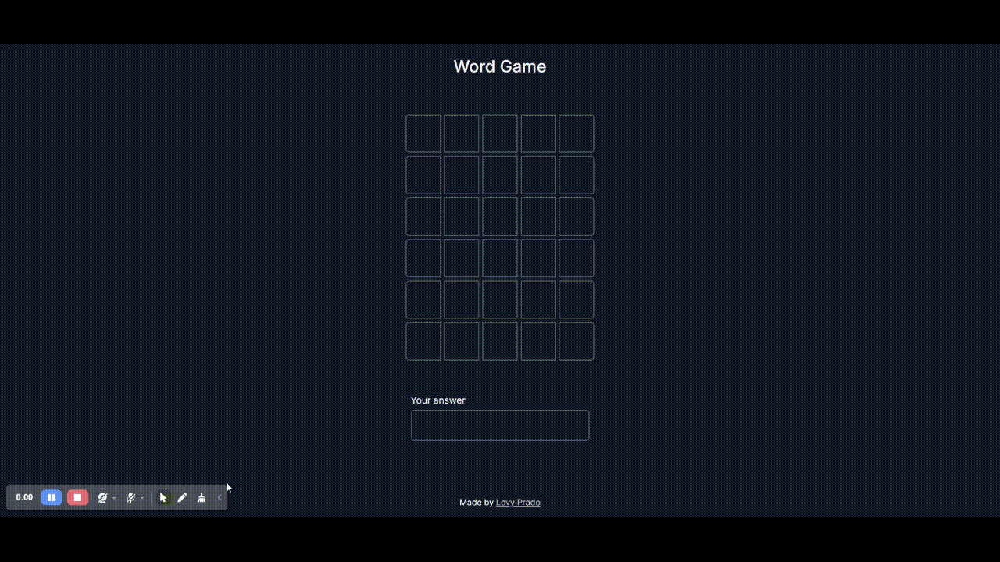

# "Word Game" Wordle based web app

My first React app. Web app inspired by the famous game 'Wordle'

### Links

- Live Site URL: [https://levyprado.github.io/word-game/](https://levyprado.github.io/word-game/)

Users should be able to:

- View the optimal layout depending on their device's screen size.
- Submit their guesses and see their incorrect, misplaced and correct letters.
- Restart the game with a new answer after winning or losing.

### Screenshots

### Built with:

- HTML
- CSS
- ReactJS
- Mobile-first workflow
